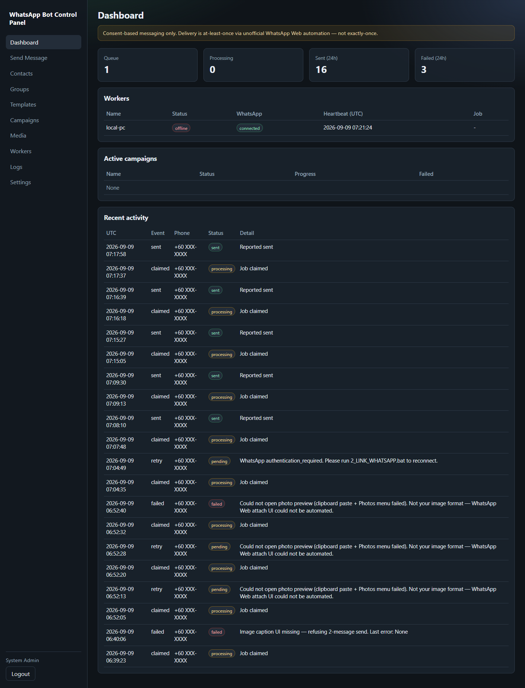
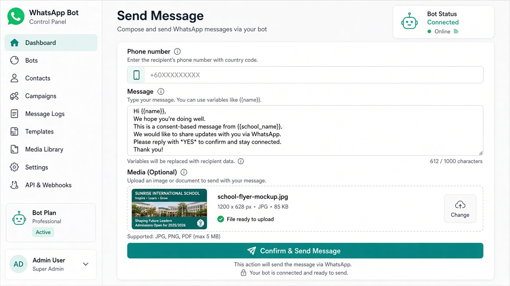
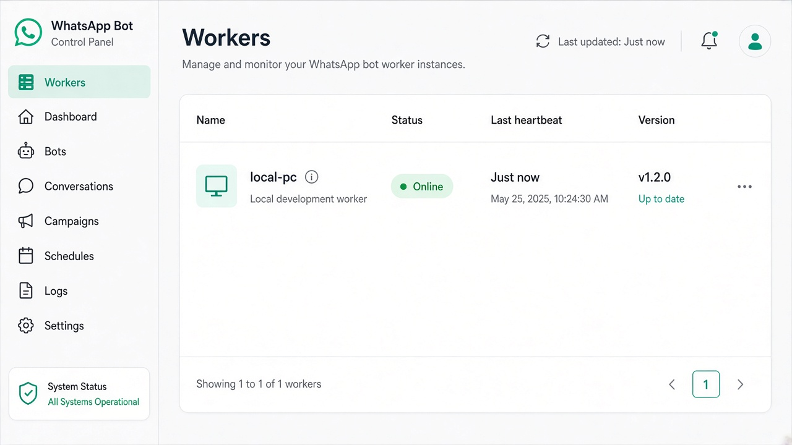

# WhatsApp Bot Control Panel

Internal **consent-based** WhatsApp messaging platform (PHP + MySQL + Windows Python/Playwright worker).

```text
PHP Web Control Panel → PHP REST API → MySQL
                              ↑
                    Windows Python Worker (Playwright → WhatsApp Web)
```

## Screenshots

| Dashboard | Send Message | Workers |
|-----------|--------------|---------|
|  |  |  |

> Real local UI screenshots — phone numbers and tokens redacted.

## Important limitations

- Unofficial WhatsApp Web automation (UI can change).
- **At-least-once** job execution — **not** exactly-once delivery.
- Browser crash after WhatsApp accepts a message but before the worker reports can cause ambiguous / duplicate sends.
- Rate limits do **not** prevent WhatsApp account enforcement.
- Use only for **consent-based** messaging you are allowed to send.

## Quick start (XAMPP)

1. Import DB (`database/install.sql` only — tables + default admin/settings):
   ```bat
   c:\xampp\mysql\bin\mysql.exe -u root -p -e "CREATE DATABASE IF NOT EXISTS whatsapp_bot CHARACTER SET utf8mb4 COLLATE utf8mb4_unicode_ci;"
   c:\xampp\mysql\bin\mysql.exe -u root -p whatsapp_bot < database\install.sql
   php database\set_admin_password.php "YourStrongPassword"
   ```
   **cPanel:** create DB in MySQL Databases → phpMyAdmin → select DB → Import → `database/install.sql`
2. Copy example configs (do **not** commit the filled copies):
   ```bat
   copy web\includes\config.local.php.example web\includes\config.local.php
   copy worker\config.example.ini worker\config.ini
   ```
   See also `database.example.php` / `database/database.example.php`.
3. Open `http://localhost/whatsapp_web_api/web/`
4. Login with the admin password you set above, then change it if needed.
5. Admin → Workers → Register → copy token **once** into `worker\config.ini`
6. Worker:
   ```bat
   worker\1_INSTALL.bat
   worker\2_LINK_WHATSAPP.bat
   worker\3_START_WORKER.bat
   ```
7. Use **Send Message** or Campaigns to queue consent-based messages.

## Docs

- [Architecture](docs/ARCHITECTURE.md)
- [Deployment](docs/DEPLOYMENT.md)
- [Engineering report](docs/ENGINEERING_REPORT.md)
- [Security / what not to commit](docs/SECURITY.md)
- [Screenshots](docs/screenshots/README.md)

## Tests

```bat
php tests\run_tests.php
php tests\test_queue.php
```

## License

MIT — see [LICENSE](LICENSE).
